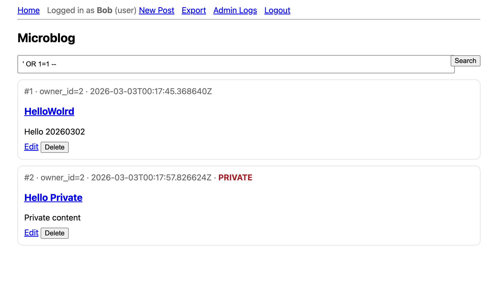
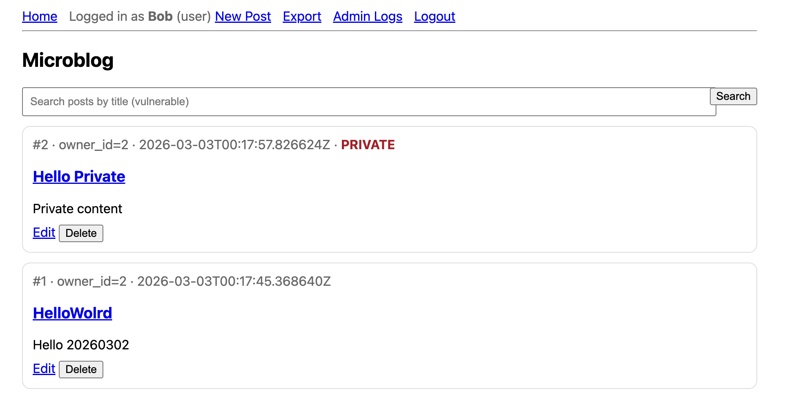
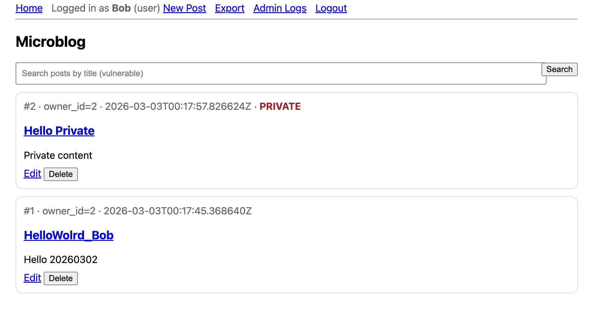
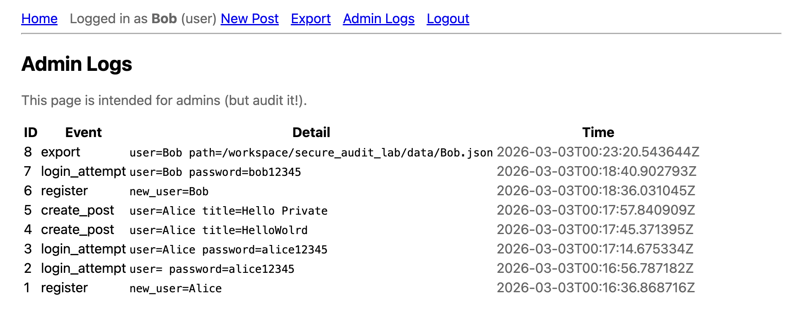
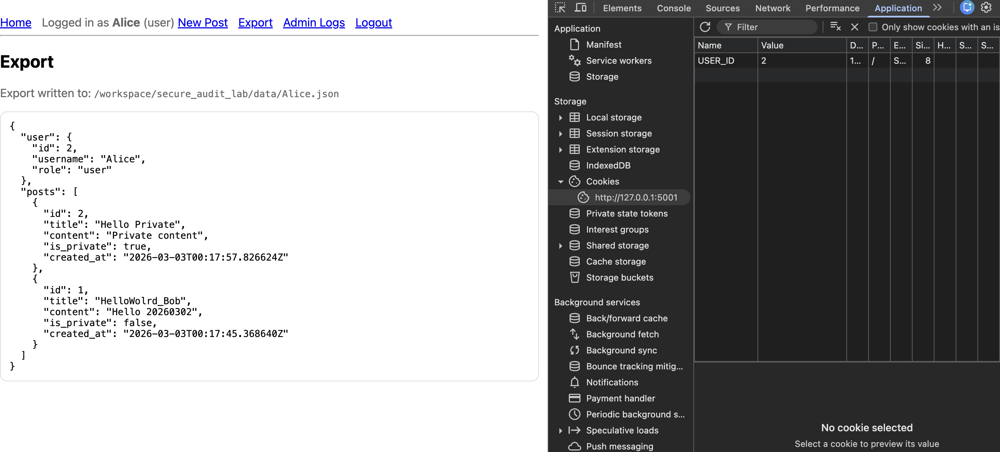
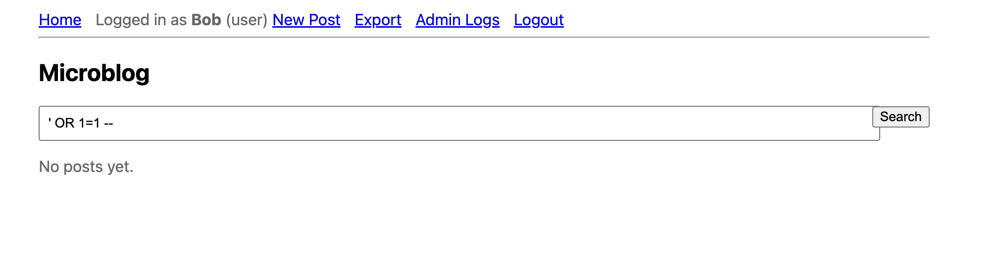
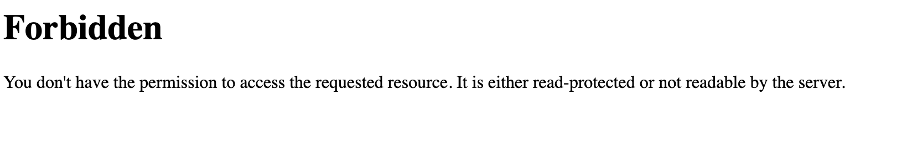
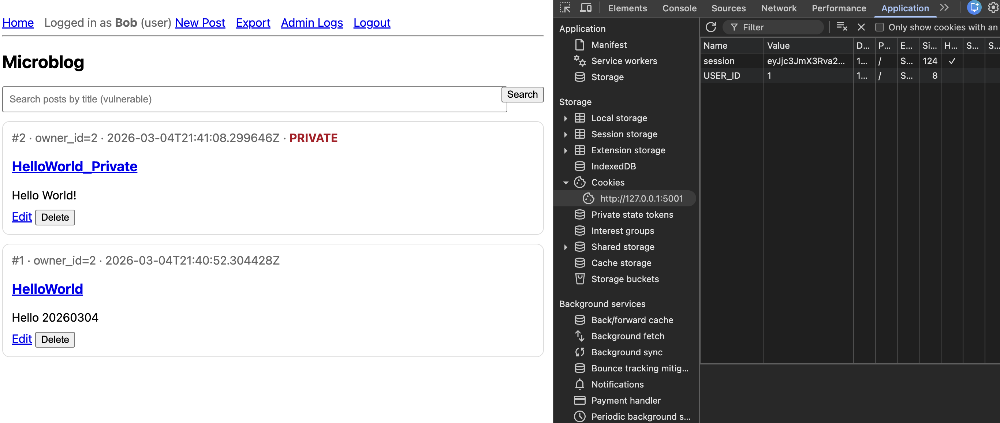

# Before

## 1. SQL Injection (Search)

- **Where it is:** app.py inside the index() function.
- **What the impact is:** The application concatenates the user's search query (q) directly into the SQL string. An attacker can inject SQL syntax (e.g., ' OR 1=1 --) to alter the query logic, allowing them to bypass filters, view all records in the database, or potentially extract data from other tables.
- **Invariant Violated:** Untrusted input must not alter SQL structure.
- **Exploit Idea:** Enter ' OR 1=1 -- into the search bar to bypass the title filter and return all database records.
- **Fix Summary:** Replaced string concatenation in app.py with SQLite parameterized queries (?).
- **Test Added:** test_sqli_login_bypass_fails - Asserts that injecting SQL syntax into a form results in a 200 OK error page rather than a successful bypass.

## 2. IDOR / Broken Access Control - Read (Private Posts)

- **Where it is:** app.py inside the index() (main feed) and view_post() functions.
- **What the impact is:** The SQL query fetches posts without checking if the requester is authorized to see them. A logged-in user (Bob) can view "Private" posts belonging to other users (Alice) either on the main feed or by directly visiting the URL GET /post/<id>.
- **Invariant Violated:** Private data must not be disclosed to unauthorized users.
- **Exploit Idea:** A logged-in user simply navigates to the main feed, or directly visits the URL /post/<id> of a private post belonging to another user, and the server serves the content without verifying authorization.
- **Fix Summary:** Added an authorization check to both the index() feed and view_post() route to verify current_user.id == post.owner_id before rendering private content.
- **Test Added:** Verified fix by logging in as Bob and confirming Alice's private posts were successfully hidden from the feed.

## 3. IDOR / Broken Access Control - Write (Editing/Deleting)

- **Where it is:** app.py inside the edit_post() and delete_post() functions.
- **What the impact is:** The routes check if a user is logged in, but fail to check if the current user is the **owner** of the post. An attacker can change the post_id in the URL or the form request to modify or delete content belonging to any other user.
- **Invariant Violated:** Users can modify only resources they own (unless admin).
- **Exploit Idea:** An attacker clicks "Edit" on their own post, but intercepts the request or modifies the post_id in the URL to point to a post owned by a different user.
- **Fix Summary:** Implemented an ownership check (if row[1] != u.id and u.role != 'admin': abort(403)) in the edit_post and delete_post routes directly after fetching the post from the database.
- **Test Added:** test_idor_edit_blocked - Logs in as Bob, attempts to send a POST request to edit a post owned by Alice, and asserts that the server correctly blocks it by returning a 403 Forbidden status code.

## 4. Sensitive Information Disclosure (Credential Logging)

- **Where it is:** app.py inside the login() and register() functions.
- **What the impact is:** The application explicitly logs the plaintext password into the audit_logs database table (and console) via log_event. If the logs are viewed, every user account is instantly compromised.
- **Invariant Violated:** Secrets must never be logged.
- **Exploit Idea:** View the plaintext server logs or the database audit_logs table to steal the plaintext passwords of all registered users.
- **Fix Summary:** Removed the password={password} string from the log_event() calls in the login and register routes. Additionally, replaced plaintext password storage with werkzeug.security password hashing.
- **Test Added:** Verified fix by checking the Admin Logs page and confirming new login attempts do not display passwords.

## 5. Broken Access Control (Admin Route)

- **Where it is:** app.py inside the admin_logs() function.
- **What the impact is:** The route handles the logic to display sensitive logs but lacks a check for current_user.role == 'admin'. Any standard user (like Bob) can access /admin/logs, leading to Privilege Escalation and the leakage of sensitive system data.
- **Invariant Violated:** Private data must not be disclosed to unauthorized users.
- **Exploit Idea:** A low-privileged user manually types the /admin/logs endpoint into their browser's URL bar to access sensitive system logs.
- **Fix Summary:** Added a role-verification check (if not u or u.role != 'admin': abort(403)) at the very beginning of the admin_logs() function to strictly enforce the admin boundary.
- **Test Added:** Verified by attempting to access the route as Bob and receiving a 403 Forbidden response.

## 6. Weak Session Handling (Forgeable Cookie)

- **Where it is:** app.py (login route) and auth.py (current_user function).
- **What the impact is:** The application uses a raw, unencrypted cookie (USER_ID=2) to identify users. Because there is no cryptographic signature, an attacker can modify this integer in their browser to impersonate any user (Account Takeover) without knowing their password.
- **Invariant Violated:** Identity tokens must be unforgeable and integrity-protected.
- **Exploit Idea:** Open the browser's Developer Tools, navigate to the Application/Storage tab, and change the plaintext USER_ID cookie to another user's ID number to instantly take over their account.
- **Fix Summary:** Removed the insecure manual cookie implementation (set_cookie('USER_ID')) and replaced it with Flask's built-in session dictionary, which cryptographically signs the cookie using the app's SECRET_KEY to prevent tampering.
- **Test Added:** Enforced across all state-changing tests implicitly. Furthermore, test_csrf_token_required_for_post was added to ensure state-changing actions require a CSRF token tied to this secure session, asserting a 403 status code if missing. 

# After

## SQL Injection (Search)

**Vulnerability Fixed:** SQL Injection in Search.

## Broken Access Control (Admin Route)

**Vulnerability Fixed**: Added a role check to ensure *current_user.role == 'admin'* *before loading the page.*

## IDOR Access Control

**Vulnerabilities Fixed:** IDOR (Read/Write/Delete), Admin Access Control.

*AI Disclosure: I used an AI assistant as a learning aid during this lab. The AI helped explain the concepts behind the vulnerabilities (like CSRF and Sessions), suggested secure library APIs (like* *werkzeug.security**), and assisted in formatting the pytest skeleton. I manually audited the application, verified the exploits, applied the logic patches, and ran the tests myself.*